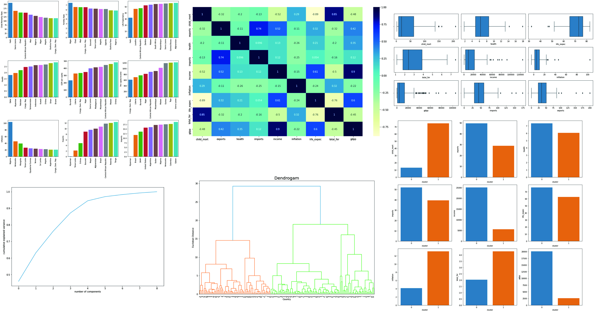

# Clustering Countries

## Project Overview
The project to determine to categorise the countries using some socio-economic and health factors that determine the overall development of the country. I am performing comprehensive EDA on Country dataset to understand important variables, outliers, and ensemble machine learning models to predict predict number of cluster and its characteristic. The model used for this project is Hierarchial Clustering with PCA before modeling.

## Framework Steps:
1. Data Preparation
2. Data Cleaning
3. EDA
4. PCA
5. Modeling

## Result

